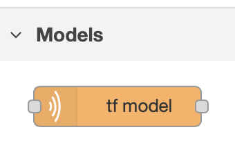

# node-red-contrib-tf-model
This is a Node-RED custom node which is used to load tensorflow models and
perform inference. Currenctly, it only supports Web friendly JSON format model
which mainly used by Tensorflow.js. SavedModel format will be added soon.

## Installation

### Prerequisite
For Tensorflow.js on Node.js
([@tensorflow/tfjs-node](https://www.npmjs.com/package/@tensorflow/tfjs-node)
or
[@tensorflow/tfjs-node-gpu](https://www.npmjs.com/package/@tensorflow/tfjs-node-gpu)),
it depends on Tensorflow shared libraries. Putting Tensorflow.js as the
dependency of custom Node-RED node may run into a situation that multiple
custom nodes install multiple `tfjs-node` module as their dependencies. While
loading multiple Tensorflow shared libraries in the same process, the process
would abord by hitting protobuf assertion.

Therefore, this module put `@tensorflow/tfjs-node` as peer dependency. You need
to install it with the Node-RED manully.

Install `@tensorflow/tfjs-node`:
```
npm install @tensorflow/tfjs-node
```

#### Note:
While writing this document, `@tensorflow/tfjs-node` hasn't supported ARM64
architecture yet nor ARM32. Here are the instructions to install
`@tensorflow/tfjs-node` on Jetson Nano and Raspberry Pi 4:
- The version must to be equal or greater then 1.5.1 (up to 1.7.0)
- Run the command to install `tfjs-node`
  ```
  npm install @tensorflow/tfjs-node
  ```
  Please append the version you need. i.e @tensorflow/tfjs-node@1.5.1. You
  would see error message while downloading/installing the shared libraries
  and node binding. But the JavaScript libraries are installed.
- Find where the package is. Usually it would be under `node_modules/@tensorflow/tfjs-node`
  from the directory you run the `npm install` command. And switch to that
  directory.
  ```
  cd node_module/@tensorflow/tfjs-node
  ```
- For Jetson Nano, you need to provide a file named `custom-binary.json` under
  `scripts` directory with the following contents:
  ```
  {
    "tf-lib": "https://s3.us.cloud-object-storage.appdomain.cloud/tfjs-cos/libtensorflow-gpu-linux-arm64-1.15.0.tar.gz"
  }
  ```
- For Raspberry Pi4, you need to provide a file named `custom-binary.json` under
  `scripts` directory with the following contents:
  ```
  {
    "tf-lib": "https://s3.us.cloud-object-storage.appdomain.cloud/tfjs-cos/libtensorflow-cpu-linux-arm-1.15.0.tar.gz"
  }
  ```
- Run the following command under `node_module/@tensorflow/tfjs-node` directory:
  ```
  npm install
  ```
  It will download the proper tensorflow shared libraries and build the node binding.

### Install this module:
Once you install the peer dependency, you can install this module:
```
npm install node-red-contrib-tf-model
```

## Usage

You can see the `tf-model` node in the `Models` category, like this:



Then you can use `tf-model` node in your flow. It only needs one property:
`Model URL`.


The `Model URL` should point to a Tensorflow.js model which is in web friendly
format. Typically, it should be a model JSON file. After you specify the
`Model URL` and deploy the flow, it will fetch the model files, including
shard files, and store them in `${HOME}/.node-red/tf-model` directory.
You can also use a model from the local file system, for example:
`file:///home/mymodel/model.json`. The new node will load the model and
maintain the cache entry. You can specify the `Ouptput Node` name when running
model inference. By default, it uses that last node as the output node.

## Data Format

When performing the inference of a Tensorflow.js model, you need to pass the
corresponding `msg.payload` to `tf-model` node. The `msg.payload` would be a
`tf.NamedTensorMap` object containing all the needed features in `tf.Tensor`
data type for the model. When a model is loaded, the input node list is output
to the console. It may help you to build the input named map for the model.
By default, the prediction runs through the whole model graph and return the
final output of that last node. You can use `Output Node` to specify different
node as output node. After model prediction, results are passed to the next
node in `msg.payload`. It could be a `tf.Tensor` or `tf.Tensor[]`.

## Examples
We provide some example flows under examples folder. They may help you to
understand the usage of `tf-model` node and other Node-RED custom node we
provide.
- [Object Detection](examples/object-detection)